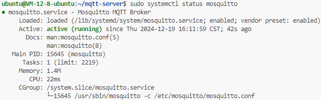
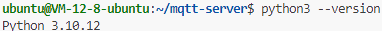
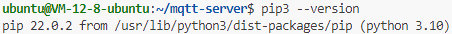

# MQTT 服务端

## 环境配置

配置 Mosquitto：

```bash
sudo apt update
sudo apt install mosquitto mosquitto-clients -y
sudo systemctl start mosquitto
sudo systemctl enable mosquitto
sudo systemctl status mosquitto
```



查看 Python 版本：

```bash
python3 --version
```



查看 Pip 版本：

```bash
pip3 --version
```



安装 Python 依赖：

```bash
pip3 install Flask flask_cors paho-mqtt gunicorn
```

## 启动 MQTT 服务端

启动 tmux 会话：

```bash
tmux new-session -s mqtt-server
gunicorn -w 4 -b 0.0.0.0:3000 app:app
```

重连 tmux 会话：

```bash
tmux attach-session -t mqtt-server
```