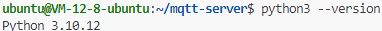
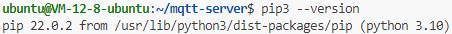

# 发布端

## 环境配置

查看 Python 版本：

```bash
python3 --version
```



查看 Pip 版本：

```bash
pip3 --version
```



安装 Python 依赖：

```bash
pip3 install Flask flask_cors requests gunicorn
```

## 启动发布端

启动 tmux 会话：

```bash
tmux new-session -s publisher-end
gunicorn -w 4 -b 0.0.0.0:3000 app:app
```

重连 tmux 会话：

```bash
tmux attach-session -t publisher-end
```